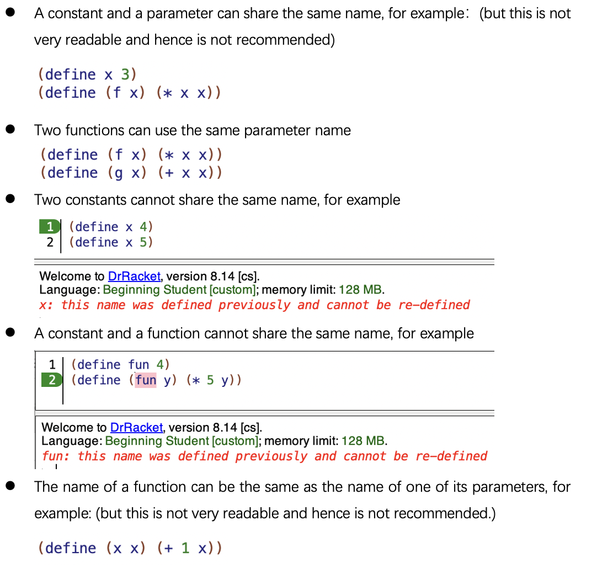
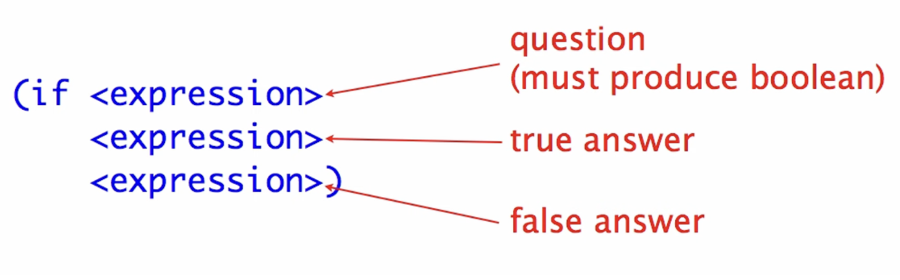
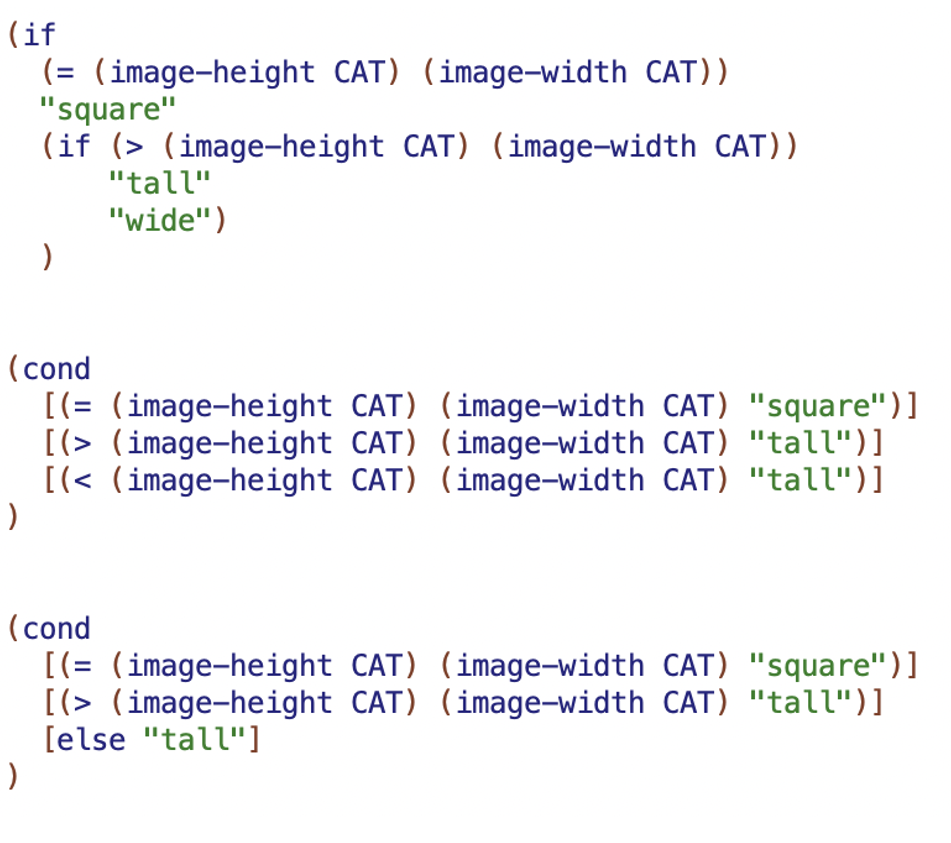
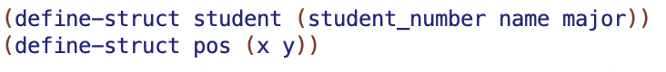
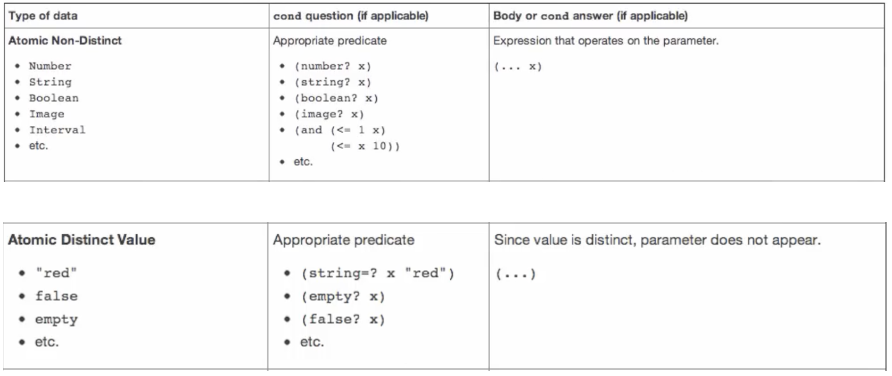
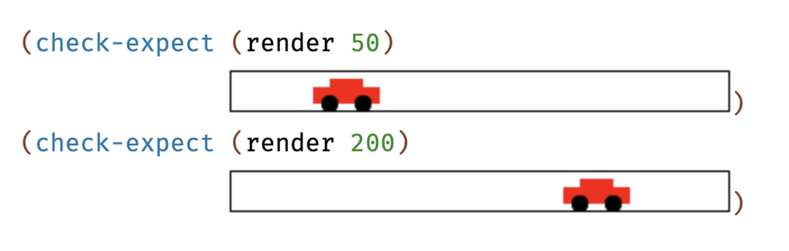
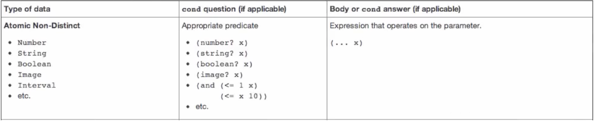
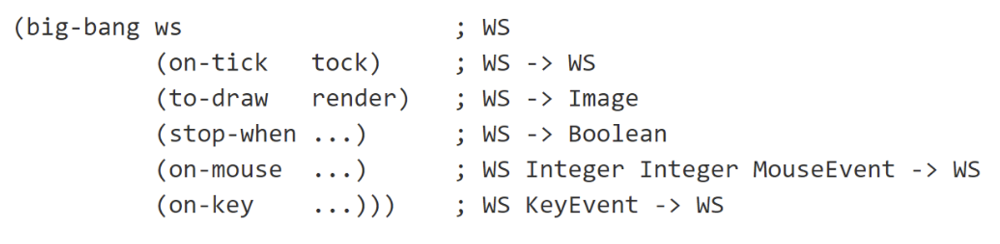

- [CPSC 110 MidReview](#cpsc-110-midreview)
  - [Primitive](#primitive)
    - [基础运算(Call to primitive)](#基础运算call-to-primitive)
    - [Booleans](#booleans)
    - [String and Image](#string-and-image)
      - [String](#string)
    - [Image](#image)
  - [Functions and Constants](#functions-and-constants)
  - [If and Cond](#if-and-cond)
  - [Compound Data](#compound-data)
  - [HTDD (how to define Data)](#htdd-how-to-define-data)
    - [为什么要使用HTDD](#为什么要使用htdd)
    - [定义数据](#定义数据)
    - [Atomic Non-Distinct and Atomic Distinct](#atomic-non-distinct-and-atomic-distinct)
    - [One of](#one-of)
      - [Enumerations](#enumerations)
      - [Itemizations](#itemizations)
    - [Compound](#compound)
    - [Mix with Compound](#mix-with-compound)
    - [多个Compound](#多个compound)
  - [HTDF (how to define Function)](#htdf-how-to-define-function)
    - [Purpose](#purpose)
    - [Signature](#signature)
    - [Stub](#stub)
    - [Examples/Tests](#examplestests)
    - [Templates](#templates)
      - [Atomic](#atomic)
      - [htdd](#htdd)
      - [Compound](#compound-1)
      - [Enumerations + compound](#enumerations--compound)
      - [Itemizations + compound](#itemizations--compound)
    - [Function body](#function-body)
  - [HTDW(how to define world)](#htdwhow-to-define-world)
    - [Big-Bang](#big-bang)
    - [Constants](#constants)
    - [Data definitions](#data-definitions)
    - [Functions:](#functions)
    - [Key and Mouse Handlers](#key-and-mouse-handlers)
  - [Self Reference](#self-reference)
    - [List htdd](#list-htdd)
  - [Reference](#reference)

# CPSC 110 MidReview

## Primitive
### 基础运算(Call to primitive)
- 什么是 Primitive Operator, Operands?
- **基础运算的运算顺序(必考点)**
  - 正常运算（* （1 + 2） 4）
  - sqr, sqrt, expt, quotient, remiander
  - (+ 1 2 3) 会直接得到 6，而不是
```
(+ 1 2 3)

(+ 3 3)

6
```

**Note:**

如果题目要求你计算 (2 + 3) * 4

你需要写成

```
( * (+ 2 3) 4)
```

而不是

```
( * 4 (+ 2 3))
```


### Booleans

- 对逻辑链接符的效果需要特别清楚，着重需要记忆的是`(and false ture)`, `(or false true)` 的区别
- **拉开你与其他学生差距的知识点：**
  - Q: 老师，我看到你发给我们的真题里，很多情况跳步了，为什么它可以跳步呢
  - A: 这个知识点我们在周课班里着重提到过，在逻辑链接符的计算过程中，有两种特殊情况可以跳步，不是任何时候都是可以跳步的，心里有答案的同学可以私信我对一下答案。


### String and Image

#### String

需要对以下几个知识点较熟

```
string-append: 将多个字符串相连
string-length: 检查string的长度
substring: 将string 切片 (前取后不取)
string=?: 比较两个string 是否相等
```

```
string<?: 比较两个string 谁小
string>?: 比较两个string 谁大

在字典中越靠前的string 越小（别问我什么字典了，商务印书馆出版的牛津字典）

比如

(string<? "apple" "banaca") ; ture
```

**Question**:

```
(string<? "apple" "Banaca") ; 为什么是false
```


### Image

图像的宽和高可以等于0

```
; 画一个红色的实心圆（半径为10）
(circle 10 “solid”“red”)

; 画一个红色的空心举行 （宽为10，长为20）
(rectangle 10 20“outline”“red”) 

; 画一个橘色的hello，字体大小为24， 注意，这个画出来的hello是image，而不是string
(text “hello” 24 “orange”) 

; 将一组image从上至下排列 （中心对齐）
(above image_1 image 2 …) 
; 将一组image从左至右排列 （中心对齐）
(beside image_1 image 2 …) 

; 将一组image叠放在一起（中心对齐）
(overlay image_1 image 2 …) 

; 将一个image旋转30度 (逆时针)
(rotate 30 image)

; 得到image-width
(image-witdh CAT)

; 得到image-height
(image-height CAT)
```

以上四种（Number， String， Image， Boolean），是我们会主要学习的四种Primitive Data.


## Functions and Constants


<p align="center">

</p>

**考点：**
- Funtcion 的 evalution rule是什么
- Function 的每一部分都叫做什么


## If and Cond

<p align="center">

</p>

<p align="center">

</p>

**考点：**
- nested if 怎么写
- if 的每一部分都叫做什么
- if 的evalution rule 是什么
- cond 的 evalution rule 是什么


## Compound Data

使用 compound data（复合数据）的好处在于，它可以更好地组织和管理相关的多项数据。通过将多个属性或字段组合成一个结构体（struct），我们可以更加直观地表示和操作这些相关联的数据。


<p align="center">
    
</p>

比如之前我要把一个球render到我的界面上，我需要给x，y两个值，但现在我只需要给一个position就可以。


```
; 定义结构体都包含什么数据
(define-struct student (student_number name major))

; 根据结构体的定义，创造一个学生，这个学生拥有：
; student_number = 101
; name = "Andy"
; major = "CS"

(define SD1 (make-student 101 "Andy"  "CS"))


; will output Andy
(student-name SD1)

; will output 101
(student-student_number SD1)

; will output True
(student? SD1)
```

**考点：**
- HTDD 怎么写（之后会讲）
- 一般都是与HTDW结合来考察


## HTDD (how to define Data)

### 为什么要使用HTDD

假设我是一个代码习惯巨差的人，我写了以下的define struct

那么想象一下你是我的同事，看到这样的代码，你并不知晓这中间的每一个数据都是什么类型，也并不知道a, b, c分别代表着什么意思

```
(define-struct student (a b c))
```

还是那个同事，写了下面的function，你并不知道这个dir代表的是一个string, 还是一个int，还是一个struct，你得去认真的读它代码function body的部分，才能明白dir是啥。

甚至，当一个项目变得庞大的时候，你可能要研究三四个function才能研究明白他写的`is_face_east`该怎么用。

```
(define (is_face_east dir)
    ;假装这里有一些代码
)
```

因此我们定义了HTDD，现在看起来可能很多东西有点脱裤子放屁，但实际上，这玩意是你通向架构师所必学的东西，现在很多大厂的程序员，升不上去，就差在这。

所以这个玩意其实很有用，他就像是，你是一个皇子，你在当上皇上之前，老师教了你巨多看上去毫无卵用的东西，完了你不听他还给你爸告状。

只有某一天你当上皇帝了，你在执行某个计划的时候，才会突然意识到，当初老师教的是为啥。


### 定义数据

比如我要定义一个CityName，我需要让看我代码的人，第一眼看到我的代码，就知道CityName怎么使用，那我该怎么写？

```
(@htdd CityName)
;; CityName is String
;; Interp. CityName is a city's name.

(define C1 "Nanjing")
(define C2 "Beijing")
(define C3 "Xi'an")
```

而为了更进一步帮助他人使用我们的代码，我们还需要为他人提供模版。

### Atomic Non-Distinct and Atomic Distinct

在 Racket 的数据设计中，Atomic Non-Distinct 和 Atomic Distinct 是两种基础的数据类型，分别用于表示不同特性的原子数据。

啥叫原子数据？

比如如果我们不能这么写

```
（Number-integerPart 2.3）
```

因为n时不可分割的，即为原子数据。

**Atomic Non-Distinct** 类型的数据是不可分割的原子值，但这些值之间没有唯一性。也就是说，这类数据可能有多个相同的值，无法区分。例如：整数、字符串等。

**Atomic Distinct** 类型的数据同样是不可分割的原子值，但这些值是唯一的，可以明确区分。通常，这类数据是枚举值，例如布尔值（true 和 false）。

<p align="center">
    
</p>


```
(@htdd SeatNumber)
;; SeatNumber is a Integer
i; interp. seat number in a row, 1 and 32 are aisle seats

(define START 1)
(define MID 16)
(define END 32)

(@dd-template-rules atomic-non-distinct) ; Integer
(define (fn-for-seatnumber sm)
    (... sn))
```

### One of

在 Racket 的数据设计中，**One of** 用于表示一个数据类型可以是多种不同类型或值的组合。它包含两种常见形式：Enumerations 和 Itemizations。

```
(cond [<question1> <answer1>]
      [<question2> <answer2>])
```

#### Enumerations

**枚举类型(Enumerations)** 表示数据的可以穷尽列出所有的可能值。

```
(@htdd LetterGrade)
;; LetterGrade is one of:
;; - "A"
;; - "B"
;; - "C"
;; interp. The Letter grade in the course 
;; <Examples are redundant for enumerations>

(add-template-rules one-of              ; 3 cases
                    atomic-non-distinct ; String
                    atomic-non-distinct ; String
                    atomic-non-distinct ; String
)

(define (fn-for-letter-grade lg)
    (cond
    [(string=? lg "A") (...)]
    [(string=? lg "B") (...)]
    [(string=? lg "C") (...)]
    ))
```

**Use else for large enumerations. Normal enumerations should not use else.**


#### Itemizations
**细分项(Itemizations)** 表示数据可以是多种不同类型的组合，每个类型之间的含义可能不同。这种类型的数据结构比枚举更复杂。

```
(@htdd CountDown)
;; CountDown is one of 
;; - false
;; - Natural[1, 10]
;; - "Complete" 
;; interp.
;;      false          means countdown is not started
;;      Natural[1, 10] means countdown is running and how many secs has passed
;;      "Complete"     means countdown is completed

(deine CD1 false)
(deine CD2 1)           ; almost over
(deine CD3 10)          ; just start running
(deine CD4 "Complete")

(add-template-rules one-of              ; 3 cases
                    atomic-distinct     ; Boolean
                    atomic-non-distinct ; Interval
                    atomic-distinct     ; String
)


(define (fn-for-count-down c)
    (cond   [(false? c) (...)]
            [(and (number? c) (<= 1 c) (<= c 10)) (... c)]
            [else (...)]
    )
)
```

**注意：**
- The cond questions must be guarded with an appropriate type predicate.
- Always use else for the last question for itemizations.

### Compound

```
(@htdd Ball)
(define-struct ball (x y))
;; Ball is (make-ball Number Number)
;; interp. a ball at position x, y 

(define BALL-1 (make-ball 6 10))

(@dd-template-rules compound) ; 2 fields
(define (fn-for-ball b)
    (... (ball-x b)           ; Number
         (ball-y b)           ; Number
    )
)
```


### Mix with Compound
```
(define-struct apple (kind weight))
;; Foo is one of:
;;  - Number
;;  - "x"
;;  - "y"
;;  - (make-apple String Number)

(@dd-template-rules one-of
                    atomic-non-distinct
                    atomic-distinct
                    atomic-distinct
                    compound)

(define (fn-for-foo f)
  (cond [(number? f) (... f)]
        [(and (string? f) (string=? f "x")) (...)]
        [(and (string? f) (string=? f "y")) (...)] ;ok w/o equality test
        [else
         (... (apple-kind f)
              (apple-weight f))]))
```


### 多个Compound

```
(define-struct crim (k d))
(define-struct rudz (s b))

;; Peat is one of:
;;  - (make-crim Integer Integer)
;;  - (make-rudz String Number)
;;  - false
;;  - "zap"

(@dd-template-rules one-of          ;4 subclasses
                    compound        ;(make-crim Integer Integer)
                    compound        ;(make-rudz String Number)
                    atomic-distinct ;false
                    atomic-distinct);"zap"

(define (fn-for-peat p)
  (cond [(crim? p)
         (... (crim-k p) ((crim-d p)))]
        [(rudz? p)
         (... (rudz-s p) (rudz-b p))]
        [(false? p) (...)]
        [else (...)]))
```

## HTDF (how to define Function)


### Purpose
The Purpose of your function is everything that describes what your function does, but not how it does it.

- 最多为一行，一句或者两句话，不要超过80个字。
- 对意外情况有说明，比如我们的function把接受两个图片，要把宽的放下面。那么你同时需要说清楚，如果一样宽会怎么样。

### Signature

Indlcudes datatypes of its parameters, the type of data the function returns.

注意一定要大写

### Stub

Stub is a function definition that:
-	has correct function name (有正确的函数名)
-	has correct number of parameters （有正确数量的参数）
-	produces dummy result of correct type （产生一个具有正确类型的虚拟结果）

Stub的用处：


**Example:**

Output 是 Number/Integer/Natural,结果为 0 
```
(define (add-one x) 0)
```

Output 是 String,结果为 “” 
```
(define (reverse s) "")
```

Output 是 Image, 结果为 empty-image
```
(define (draw-pig i) empty-image)
```

Output 是 Boolean, 结果为 false
```
(define (strong? m) false)
```

Output 是 compound data, 结果为parameter中相同的, (不要问我如果parameter中没相同的怎么办，考试没见过，教授也没举过例子，如果考试真遇到了，就在后面写(make-info ...))
```
(define (update-info info) info)
```

对于render function，结果为MTS (exmaple in HTDW)

### Examples/Tests

Examples are extremely effective in helping others understand your code. Words describing what a function does can be vague and ambiguous, but examples are explicit and precise.

考试，作业最难拿全分的部分，80%的错误都出在这里，但是，考试的Examples其实是有迹可循的，所以需要多做往年的题，总结出来一般都需要考虑到什么情况。

<p align="center">
    
</p>

### Templates

#### Atomic
在我们这节课中，我们写的任何一个Function，实际都基于一个固定的模版，而识别出我们需要使用出哪一个模版，是我们这节课比较关键的信息。

比如：

当我们使用Number, String, Image 或 Boolean 这种Atomic Non-Distinct data时，下面是一个例子：

```
(@template-origin Number)

(@template   
 (define (add-one n)
  (... n)))
```

<p align="center">
    
</p>


这来自于 Atomic Non-Distinct data的template，因此我们需要注明来源自Number的template。

如果input有多个Atomic Non-Distinct data，那么我们默认使用第一个放在template-origin里，因为Number的template和String的template 没有区别。


**Examples**
```
(@sigature String Number Number Number -> String)
(@template-orgin String)
(@template (some_funciton_name str a b)
    (... str a b)
)
```

```
(@signature Image Natural Natural -> Boolean)
(@template-origin Image) 
(@template
 (define (fits? img w h)
   (... img w h)))
```


#### htdd
我们使用htdd定义的数据，template-origin则会有所不同，大部分情况复制HTDD中的Template即可。

比如我们使用了CountDown的话，我们需要使用CountDown的template.

```
;; CountDown is one of 
;; - false
;; - Natural[1, 10]
;; - "Complete" 
;; interp.
;;      false          means countdown is not started
;;      Natural[1, 10] means countdown is running and how many secs has passed
;;      "Complete"     means countdown is completed

(@template-origin CountDown)

(@template
 (define (count-start cd)
  (cond [(false? cd) (...)]
        [(and (number? cd) (<= 1 cd) (<= cd 10)) (... cd)]
        [else (...)]
    )
))
```

如果CountDown和numebr同时作为function的参数使用，则不写numebr在template-origin中，只写CountDown。

#### Compound

当我们在function构思的时候，发现我们要分割b，即使用(ball-x ...) (ball-y ...)，那么意味着我们我们需要使用compound Rule。复制HTDD中的Template即可。

```
(@template-origin BALL)
(@template
    (define (render b)
        (... (ball-x b)           ; Number
             (ball-y b)           ; Number
        )
    )
)
```

当我们在function构思的时候，发现我们不要分割b，那么意味着我们是把它当作一个原子数据来看，那么意味着我们我们需要使用Atomic Non-Distinct Rule，template-origin后面跟的是compounddata内部的数据类型

```
(@template-origin Number)
(@template 
    (define (next-ball b)
        (... b))
)
```

#### Enumerations + compound

```
(@htdd LetterGrade)
;; LetterGrade is one of:
;; - "A"
;; - "B"
;; - "C"
;; interp. The Letter grade in the course 
;; <Examples are redundant for enumerations>

(@htdd Ball)
(define-struct ball (x y dx dy))
;; Ball is (make-ball Number Number Number Number)
;; interp. (make-ball x y dx dy) is ball
;;   - position x, y    in screen coordinates
;;   - velocity dx, dy  in pixels/tick

(@template-origin LetterGrade Ball)
(@template   
    (define (some_funciton_name b lg)
        (cond 
            [(string=? lg "A") (... (ball-x b) 
                                (ball-y b) 
                                (ball-dx b) 
                                (ball-dy b))]
            [(string=? lg "B") (... (ball-x b) 
                                (ball-y b) 
                                (ball-dx b) 
                                (ball-dy b))]
            [(string=? lg "C") (... (ball-x b) 
                                (ball-y b) 
                                (ball-dx b) 
                                (ball-dy b))]
        )
    )
)

```

#### Itemizations + compound

自己写一个，找我对答案
```
(@htdd CountDown)
;; CountDown is one of 
;; - false
;; - Natural[1, 10]
;; - "Complete" 
;; interp.
;;      false          means countdown is not started
;;      Natural[1, 10] means countdown is running and how many secs has passed
;;      "Complete"     means countdown is completed

(@htdd Ball)
(define-struct ball (x y dx dy))
;; Ball is (make-ball Number Number Number Number)
;; interp. (make-ball x y dx dy) is ball
;;   - position x, y    in screen coordinates
;;   - velocity dx, dy  in pixels/tick

(@template-origin CountDown Ball)

(@template-origin CountDown Ball)
(@template   
    ...
)
```


### Function body

在书写function body的时候，一定要将template copy下来，并只做最小的改动。

## HTDW(how to define world)


### Big-Bang
<p align="center">
    
</p>

- on-tick:基本每次都会用到，用来随着时间 update。 
- to-draw:基本每次都会用到，用来 display 当下情况的 image。 
- stop-when: 很少用到，除非老师上课重点讲了，不然不需要考虑。 
- on-mouse:当需要根据鼠标对 program 进行改变。


**Note:**
- 在距离右，下边界的时候，实际位置要减一

```Example
(require 2htdp/image)
(require 2htdp/universe)
(require spd/tags)

(define WIDTH  100)
(define HEIGHT 100)

(define MTS (empty-scene WIDTH HEIGHT))

(place-image (rectangle 10 10 "outline" "red") 50 50 MTS)

(place-image (rectangle WIDTH HEIGHT "outline" "red") 50 50 MTS)
```


```Example
(define WIDTH  605)
(define HEIGHT 535)

(define BALL-RADIUS 10)

(define TOP (+ 0        BALL-RADIUS)) ;these constants define the "inner box"
(define BOT (- HEIGHT 1 BALL-RADIUS)) ;that constrains the center of the ball
(define LEF (+ 0        BALL-RADIUS)) ;
(define RIG (- WIDTH  1 BALL-RADIUS)) ;
```

### Constants

无论 program 发生什么都不被改变的东西。比方所背景图的高和宽.可以在图片中标注出你constant 所代表的东西(height，width, mts...)

```
(@htdw Cat)

;; Constants:

(define WIDTH  200)
(define HEIGHT 200)

(define CAT-IMG (circle 10 "solid" "red")) ; a not very attractive cat

(define MTS (empty-scene WIDTH HEIGHT))
```

### Data definitions
```
;; Data definitions:

(@htdd Cat)
;; Cat is Number
;; interp. x coordinate of cat (in screen coordinates)
(define C1 1)
(define C2 30)

(@dd-template-rules atomic-non-distinct)
  
(define (fn-for-cat c)
  (... c))

```

### Functions:
```
(@htdf main)
(@signature Cat -> Cat)
;; start the world with initial state c, for example: (main 0)

(@template-origin htdw-main)

(define (main c)
  (big-bang c                         ; Cat
            (on-tick   tock)          ; Cat -> Cat
            (to-draw   render)))      ; Cat -> Image

(@htdf tock)
(@signature Cat -> Cat)
;; Produce cat at next position
;!!!
(define (tock c) 1)  ;stub

(@htdf render)
(@signature Cat -> Image)
;; produce image with CAT-IMG placed on MTS at proper x, y position
; !!!
(define (render c) MTS)
```

### Key and Mouse Handlers

The on-key and on-mouse handler function templates are handled specially. 

The on-key function is templated according to its second argument, a `KeyEvent`, using the **large enumeration rule**. 

```
(@template-origin KeyEvent)

(@template   
 (define (handle-key ws ke)
   (cond [(key=? ke " ") (... ws)]
         [else 
          (... ws)])))
```

The on-mouse function is templated according to its `MouseEvent` argument, also using the **large enumeration rule**.

```
(@template-origin MouseEvent)

(@template
 (define (handle-mouse ws x y me)
   (cond [(mouse=? me "button-down") (... ws x y)]
         [else
          (... ws x y)])))
```

**Example**

```
(@htdd Ball)
(define-struct ball (x y dx dy))
;; Ball is (make-ball Number Number Number Number)
;; interp. (make-ball x y dx dy) is ball
;;   - position x, y    in screen coordinates
;;   - velocity dx, dy  in pixels/tick

...


(@htdf handle-mouse)
(@signature Ball Integer Integer MouseEvent -> Ball)
;; replace ball with new ball on mouse click
;; NOTE: uses random, so testing has to use check-random

;(define (handle-mouse b x y me) b)

(@template-origin MouseEvent)

(@template
 (define (handle-mouse b x y me)
   (cond [(mouse=? me "button-down") (... b x y)]
         [else
          (... b x y)])))

(define (handle-mouse b x y me)
  (cond [(mouse=? me "button-down")
         (make-ball x y (- 5 (random 11)) (- 5 (random 11)))]
        [else b]))
```

```
(@htdd Balloon)
(define-struct balloon (r c dr))
;; Balloon is one of:
;; - false
;; - (make-balloon Natural String Integer)
;; interp. a balloon is either popped (false) or has a r(adius) in pixels,
;;         c(olor), and dr is the rate per tick at which the radius changes,
;;         dr is positive if the balloon is getting bigger or negative if
;;         the balloon is shrinking. 
;; CONSTRAINT: Balloon radius is in [MIN, MAX], rate is never 0.
...

(@htdf handle-key)
(@signature Balloon KeyEvent -> Balloon)
;; on space flip rate from + to - or vice versa; on p change color to purple

(@template-origin KeyEvent Balloon)

(@template   
 (define (handle-key b ke)
   (cond [(key=? ke " ")
          (cond [(false? b) (...)]
                [else (... (balloon-r b)
                           (balloon-c b)
                           (balloon-dr b))])]
         [(key=? ke "p")
          (cond [(false? b) (...)]
                [else (... (balloon-r b)
                           (balloon-c b)
                           (balloon-dr b))])]
         [else 
          (... b)])))

```


## Self Reference
考虑以下伪代码
```
(define (练腹肌 （天数 腹肌数）)
    (cond
        [(eq? 腹肌数 16） (天数))]
        [else 练腹肌 （天数 + 1 腹肌数 + 2）]
    )
)
```

可以将其转化为

```
(define-struct plan (day fuji))

(define (exercise p)
    (cond
        [(eq? (plan-fuji p) 16) (plan-day p)]
        [else (exercise (make-plan 
                                (+ 1 (plan-day p))
                                (+ 2 (plan-fuji p))
                        ))
        ]
    )
)

(define init (make-plan 0 0))
(exercise init)
```


考虑以下伪代码, list(刀削面 方便面 刀削面 方便面 刀削面 方便面 empty)
```
(define (吃了几天刀削面 吃饭记录)
    (cond
        [(eq? 吃饭记录 empty) 0]
        [(eq? (first list) 刀削面) 1 + (吃了几天刀削面 第一天之后的吃饭记录)]
        [else 0 + (吃了几天刀削面 第一天之后的吃饭记录)]
    )
)
```

我们将其转化为代码, 比如我们要计算一个list中的所有数的和：

```
(define (sum lst)
    (cond
        [(eq? lst empty) 0]
        [else (+ (first lst)
                 (sum (rest lst)))]
    )
)

(define LST (cons 4 (cons 3 (cons 1 (cons 9 (cons 87 (cons 22 (cons 100 empty))))))))
(sum LST)
```


**Exercise:**

数一个list中有几个偶数。

写完找我对答案


### List htdd

```
(@htdd ListOfString)
;; ListOfString is one of:
;;  - empty
;;  - (cons String ListOfString)
;; interp. a list of strings

(define LOS-1 empty)
(define LOS-2 (cons "a" empty))
(define LOS-3 (cons "b" (cons "c" empty)))

(@dd-template-rules one-of            ;2 cases
                    atomic-distinct   ;empty
                    compound          ;(cons String ListOfString)
                    self-ref)         ;(rest los) is ListOfString

(define (fn-for-los los)
  (cond [(empty? los) (...)]                   ;BASE CASE
        [else (... (first los)                 ;String
                   (fn-for-los (rest los)))])) ;NATURAL RECURSION
```


## Reference

一个 Data definition 中使用了另外一个 Non-primitive 的 Data

```
(@htdd Dot)
(define-struct dot (x y))
;; Dot is (make-dot Integer Integer)
;; interp. A dot on the screen, w/ x and y coordinates in pixels.
(define D1 (make-dot 10 30))

(@dd-template-rules compound)  ;2 fields

(define (fn-for-dot d)
  (... (dot-x d)   ;Integer
       (dot-y d))) ;Integer

(@htdd ListOfDot)
;; ListOfDot is one of:
;;  - empty
;;  - (cons Dot ListOfDot)
;; interp. a list of Dot
(define LOD1 empty)
(define LOD2 (cons (make-dot 10 20) (cons (make-dot 3 6) empty)))

(@dd-template-rules one-of               ;2 cases
                    atomic-distinct      ;empty
                    compound             ;(cons Dot ListOfDot)
                    ref                  ;(first lod) is Dot 
                    self-ref)            ;(rest lod) is ListOfDot

(define (fn-for-lod lod)
  (cond [(empty? lod) (...)]
        [else
         (... (fn-for-dot (first lod))   ; Natural helper
              (fn-for-lod (rest lod)))   ; Natural Recusion
        ]))
```


